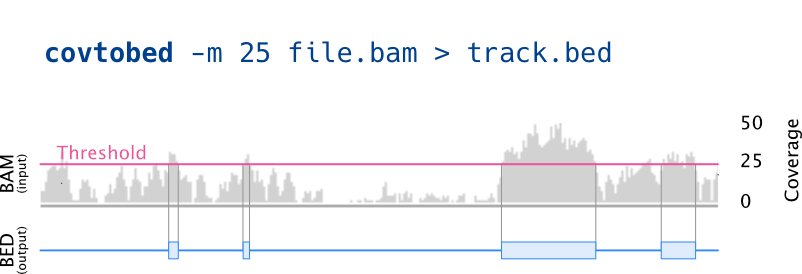

# covtobed

[](https://github.com/telatin/covtobed/blob/master/LICENSE)
[](http://bioconda.github.io/recipes/covtobed/README.html)
[](https://anaconda.org/bioconda/covtobed)
[](https://travis-ci.org/telatin/covtobed)
[](https://hub.docker.com/r/andreatelatin/covtobed)
[](https://zenodo.org/record/3600261)
[](https://www.codacy.com/manual/telatin/covtobed?utm_source=github.com&amp;utm_medium=referral&amp;utm_content=telatin/covtobed&amp;utm_campaign=Badge_Grade)
[](https://joss.theoj.org/papers/0ed74df9f40a58a852bf3fff512acd2b)

### a tool to generate BED coverage tracks from BAM files

Reads one (or more) [alignment](https://en.wikipedia.org/wiki/Sequence_alignment) files
(sorted [BAM](https://en.wikipedia.org/wiki/SAM_(file_format))) and prints a [BED](https://en.wikipedia.org/wiki/BED_(file_format)) with the [coverage](https://en.wikipedia.org/wiki/Coverage_(genetics)). It will join consecutive bases with the same coverage, and can be used to only print a BED file with the regions having a specific coverage range. 

:book: **[Read more in the wiki](https://github.com/telatin/covtobed/wiki)** - this is the **main** documentation source


[](https://github.com/telatin/covtobed/wiki)


## Usage

:book: **The complete documentation is available in the [GitHub wiki](https://github.com/telatin/covtobed/wiki).**

Synopsis:
```
Usage: covtobed [options] [BAM]...

Computes coverage from alignments

Options:
  -h, --help            show this help message and exit
  --version             show program's version number and exit
  --physical-coverage   compute physical coverage (needs paired alignments in input)
  -q MINQ, --min-mapq=MINQ
                        skip alignments whose mapping quality is less than MINQ
                        (default: 0)
  -m MINCOV, --min-cov=MINCOV
                        print BED feature only if the coverage is bigger than
                        (or equal to) MINCOV (default: 0)
  -x MAXCOV, --max-cov=MAXCOV
                        print BED feature only if the coverage is lower than
                        MAXCOV (default: 100000)
  -l MINLEN, --min-len=MINLEN
                        print BED feature only if its length is bigger (or equal
                        to) than MINLELN (default: 1)
  -d, --discard-invalid-alignments
                        skip duplicates, failed QC, and non primary alignment,
                        minq>0 (or user-defined if higher) (default: 0)
  --output-strands      output coverage and stats separately for each strand
  --format=CHOICE       output format
```
## Example

Command:
```
covtobed -m 0 -x 5 test/demo.bam
```
Output:
```text
[...]
NC_001416.1     0       2       0
NC_001416.1     2       6       1
NC_001416.1     6       7       2
NC_001416.1     7       12      3
NC_001416.1     12      18      4
NC_001416.1     169     170     4
NC_001416.1     201     206     4
[...]
```

See the full example output from different tools [:open_file_folder: here](https://github.com/telatin/covtobed/blob/master/test/output/README.md)

## Install

* To install with Miniconda:

```bash
conda install -c bioconda covtobed
```

* Both **covtobed**, and the legacy program [**coverage**](https://github.com/telatin/covtobed/wiki/Using-coverage) are available as a single Docker container available from Docker Hub [](https://hub.docker.com/r/andreatelatin/covtobed):

```bash
sudo docker pull andreatelatin/covtobed
sudo docker run --rm -ti andreatelatin/covtobed coverage -h
```

 * Download Singularity image by `singularity pull docker://andreatelatin/covtobed`, then:

```bash
singularity exec covtobed.simg coverage -h
```

## Performance

*covtobed* is generally faster than *bedtools*. More details are in the [benchmark](benchmark) page.

## Requirements and compiling

This tool requires **libbamtools** and **zlib**.

To manually compile:
```
c++ -std=c++11 *.cpp -I/path/to/bamtools/ -L${HOME}/path/to/lib/ -lbamtools -o covtobed
```

## Issues, Limitations and how to contribute

* This program will read the coverage from *sorted BAM* files. The *CRAM* format is not supported at the moment.
* If you find a problem feel free to [raise an issue](https://github.com/telatin/covtobed/issues), we will try to address it as soon as possible
* [Contributions](CONTRIBUTING.md) are welcome via PR.

## Acknowledgements

This tools uses [libbamtools](https://github.com/pezmaster31/bamtools) by Derek Barnett, Erik Garrison, Gabor Marth and Michael Stromberg, and [cpp-optparse](https://github.com/weisslj/cpp-optparse) by Johannes Weißl. Both tools and this program are released with MIT license.

## Authors

Giovanni Birolo ([@gbirolo](https://github.com/gbirolo)), University of Turin, and Andrea Telatin ([@telatin](https://github.com/telatin)), Quadram Institute Bioscience. 

This program was finalized with a Flexible Talent Mobility Award funded by BBSRC through the [Quadram Institute](https://quadram.ac.uk).

## Citation

If you use this tool, why not citing the paper?

> Birolo et al., (2020). covtobed: a simple and fast tool to extract coverage tracks from BAM files. Journal of Open Source Software, 5(47), 2119, https://doi.org/10.21105/joss.02119

BibTeX citation:
```latex
@article{Birolo2020,
  doi = {10.21105/joss.02119},
  url = {https://doi.org/10.21105/joss.02119},
  year = {2020},
  publisher = {The Open Journal},
  volume = {5},
  number = {47},
  pages = {2119},
  author = {Giovanni Birolo and Andrea Telatin},
  title = {covtobed: a simple and fast tool to extract coverage tracks from BAM files},
  journal = {Journal of Open Source Software}
}
```
