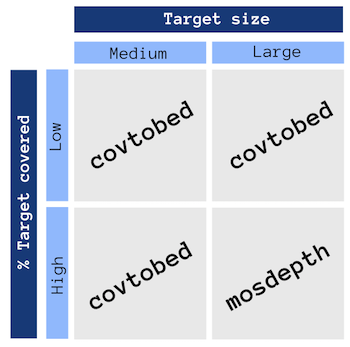

# Benchmark

Here we compare the speed of *covtobed* with:
* *bedtools genomecov* - a widely used tool that will produce the same BED output as *covtobed*, exept for a different sorting of empty chromosomes
* *mosdepth* - a powerful tool for genome coverage analysis that will also produce a BED file, although default parameters will be filtering out probably spurious alignments

*covtobed* is significantly faster than *bedtools genomecov*.
*covtobed* is faster than *mosdepth* on small genomes, and on large genomes (like the Human genome) with a limited fraction of the target covered (e. g. target enrichment panels). With panels it can be up to 60X faster than *mosdepth*.
With large genomes highly *covered* (e. g. exomes, whole genome sequencing) is slightly slower than *mosdepth* (3-4X slower).

*sambamba* also performs coverage statistics but will not print a BED file. A test has been done to compare the speed that appear slower, possibly also because of the bigger output printed. See: [comparisong with sambamba](sambamba.md)

## How to run

The benchmark has been performed using [hyperfine](https://github.com/sharkdp/hyperfine), installable via conda.

To download the datasets use the `get_datasets.sh` script. 
The script will download two target enrichment panels (BAM).
If invoked with a parameter, will also download an exome from the 1000 Genomes Project.

A `benchmark_stream.sh` script will compare _covtobed_ to _bedtools_, redirecting the output to `/dev/null`,
while `benchmark_disk.sh` will also compare _mosdepth_.

_samtools_ is only included in the streaming section, but should be noted that produces a non-BED output, and the coverage will not be counted in deletions, that is not the intended behaviour in _covtobed_ (but this explains the much bigger computation time).

## Results: Linux VM (64 Gb RAM, 8 cores)

*covtobed* is constantly faster than *bedtools*.

*covtobed* is up to 20 times faster than *mosdepth* on medium datasets (_e. g._ Human gene panels), while on larger datasets (_e. g._ Human whole exomes) it's up to 5 times slower.

### Human panel - Saving the output to disk

This is the test done saving to file. 
Note that _mosdepth_ will save the file compressed and indexed, thus requiring more time, 
and it's the only program tested supporting multithreading (only for BAM decompression). 

See also [example2.bam benchmark](disk/benchmark2_example2.md).

| Command | Mean [s] | Min [s] | Max [s] | Relative |
|:---|---:|---:|---:|---:|
| `mosdepth -x m_ example1.bam` | 68.344 ± 1.750 | 66.352 | 69.629 | 65.23 ± 2.22 |
| `mosdepth -x -t 4  m2_ ex1.bam` | 65.891 ± 0.736 | 65.123 | 66.590 | 62.89 ± 1.57 |
| `covtobed  example1.bam > ex1.bed` | 1.048 ± 0.023 | 1.021 | 1.063 | 1.00 |
| `bedtools genomecov -bga -ibam ex1.bam > ex1.bed` | 32.478 ± 0.798 | 31.830 | 33.370 | 31.00 ± 1.03 |

### Human exome (chromosome) - Saving to disk

* chr1

| Command | Mean [s] | Min [s] | Max [s] | Relative |
|:---|---:|---:|---:|---:|
| `mosdepth -x m_chr1 chr1.bam` | 35.681 ± 0.650 | 35.154 | 36.974 | 1.41 ± 0.03 |
| `mosdepth -x -t 4 m_chr1 chr1.bam` | 25.347 ± 0.362 | 25.044 | 25.940 | 1.00 |
| `covtobed chr1.bam > chr1.bed` | 128.576 ± 3.142 | 122.704 | 131.607 | 5.07 ± 0.14 |
| `bedtools genomecov -bga -ibam chr1.bam > chr1.bed` | 223.619 ± 6.603 | 217.182 | 235.391 | 8.82 ± 0.29 |

* chr21

| Command | Mean [s] | Min [s] | Max [s] | Relative |
|:---|---:|---:|---:|---:|
| `mosdepth -x m_chr21 chr21.bam` | 6.511 ± 0.156 | 6.384 | 6.809 | 1.29 ± 0.04 |
| `mosdepth -x -t 4 m_chr21 chr21.bam` | 5.064 ± 0.108 | 4.965 | 5.248 | 1.00 |
| `covtobed chr21.bam > chr21.bed` | 18.764 ± 0.633 | 18.115 | 19.941 | 3.71 ± 0.15 |
| `bedtools genomecov -bga -ibam chr21.bam > chr21.bed` | 62.386 ± 1.472 | 60.422 | 63.909 | 12.32 ± 0.39 |

* See also [all chromosomes results](https://github.com/telatin/covtobed/tree/master/benchmark/exome_chromosomes)

### Human whole genome sequencing - Saving to disk

The human genome was downloaded from [here](ftp://ftp.1000genomes.ebi.ac.uk/vol1/ftp/data_collections/1000_genomes_project/data/GBR/HG00114/alignment/HG00114.alt_bwamem_GRCh38DH.20150718.GBR.low_coverage.cram).

| Command | Mean [s] | Min [s] | Max [s] | Relative |
|:---|---:|---:|---:|---:|
| `mosdepth -F 4 -x -t 4 mos4_ ../TE/genome.bam` | 327.083 ± 16.054 | 316.223 | 345.524 | 1.00 |
| `covtobed ../TE/genome.bam > covtobed_genome.bed` | 1487.047 ± 78.500 | 1400.713 | 1554.132 | 4.55 ± 0.33 |
| `bedtools genomecov -bga -ibam ../TE/genome.bam > bedtools_genome.bed` | 1926.564 ± 10.983 | 1914.994 | 1936.846 | 5.89 ± 0.29 |
